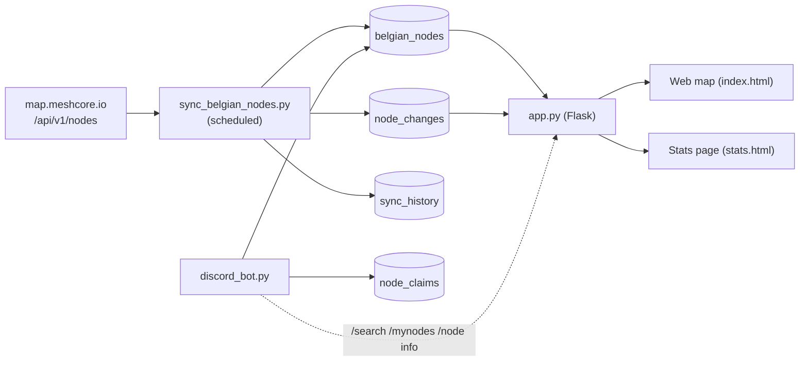

# RRY-Map-Bot

A Discord bot and web map for **Belgian MeshCore nodes**, syncing from
[`https://map.meshcore.io/api/v1/nodes`](https://map.meshcore.io/api/v1/nodes).

The web app shows every active Belgian node on a Leaflet map with stats,
an activity timeline, and historical playback. The Discord bot lets users
search the directory and claim ownership of their own nodes.

The live deployment is at [meshmap.radio-actief.be](https://meshmap.radio-actief.be).

## Quick start

Prerequisites:

- Docker and Docker Compose
- A Discord bot token if you want the bot online (web map runs without it)

```bash
git clone <this-repo>
cd RRY-Map-Bot
cp .env.example .env       # fill in DISCORD_* and FLASK_SECRET_KEY
docker compose build

# Initialise the database (creates tables, backfills first-seen dates,
# seeds node_claims from current owners). Safe to re-run.
docker compose run --rm api python -m backend.migrations.reset_history --confirm

# Pull the official Belgium feed once so the map has data on first load.
docker compose run --rm sync python3 backend/sync_belgian_nodes.py

# Bring up the web map on http://localhost:8000.
docker compose up -d api

# Optional services.
docker compose up -d sync          # scheduled background syncs
docker compose up -d discord-bot   # online Discord bot
```

Run the test suite inside the image:

```bash
docker compose run --rm api pytest -q tests/
```

Verify the four count surfaces agree against the running API:

```bash
docker compose exec api python tests/check_invariants.py http://localhost:8000
```

## How it works



**Sync.** `sync_belgian_nodes.py` fetches the official feed, filters Belgium by
geocoding against `data/be-municipalities.geojson`, writes the resulting rows
into `belgian_nodes`, and records every add / remove / update / restore in
`node_changes`. Each run also writes a per-run summary into `sync_history`.

**Stats chart.** The chart's first-seen seed counts each currently displayable
node on its `inserted_date`; daily increments come from `node_changes`. Map
header, stats chips, chart, and timeline playback all read the same row set
(`is_active = 1 AND adv_lat IS NOT NULL AND adv_lon IS NOT NULL`), so totals
match by construction.

**Discord ownership.** `/node claim` and `/node unclaim` set
`discord_owner_id` and `discord_owner_name` on `belgian_nodes` and append an
event row to `node_claims` with a timestamp. `node_claims` is an append-only
log of every claim/unclaim event.

## Configuration

`.env` is loaded by all three services. Keys (see `.env.example` for examples):

- `DISCORD_BOT_TOKEN`, `DISCORD_GUILD_ID`, `STARTUP_CHANNEL_ID`,
  `STARTUP_MESSAGE_ID` – Discord bot.
- `DISCORD_OAUTH2_CLIENT_ID`, `DISCORD_OAUTH2_CLIENT_SECRET`,
  `DISCORD_OAUTH2_REDIRECT_URI`, `FLASK_SECRET_KEY`,
  `SESSION_COOKIE_SECURE`, `DISCORD_SERVER_INVITE_URL` – web auth.
- `DATABASE_PATH` – SQLite path (default `data/belgian_nodes.db`).
- `OFFICIAL_API_URL` – upstream feed (default
  `https://map.meshcore.io/api/v1/nodes`).
- `BE_MUNICIPALITIES_GEOJSON`, `GEOCODE_BUFFER_METERS`, `GEOPY_USER_AGENT`,
  `GEOPY_TIMEOUT`, `USE_GEOPY_FALLBACK` – Belgian geocoder.
- `SYNC_INTERVAL_MINUTES` (or legacy `SYNC_INTERVAL_HOURS`) – scheduled sync
  interval.
- `DAILY_DIGEST_ENABLED`, `DAILY_DIGEST_HOUR`, `DAILY_DIGEST_MINUTE`,
  `DAILY_DIGEST_TZ`, `DAILY_DIGEST_CHANNEL_ID` – daily activity digest.

## Database tables

- `belgian_nodes` – every Belgian node currently or recently seen on the map.
- `node_changes` – per-event ledger (added / removed / restored / updated)
  emitted by the sync.
- `sync_history` – one row per sync run with aggregate counts.
- `node_claims` – append-only event log of `/node claim` and `/node unclaim`.
- `digest_state` – single-row state for the daily Discord digest.

## Discord commands

- `/search <query>` – substring search across nodes.
- `/mynodes` – list nodes owned by the caller.
- `/node info <query>` – detailed view of a single node.
- `/node claim <query>` – claim ownership of a node.
- `/node unclaim <query>` – release ownership of a claimed node.
- `/stats` – network statistics.
- `/digest run` – manually trigger the daily activity digest.

## Project structure

```
RRY-Map-Bot/
  backend/
    api/app.py                 # Flask API + static assets
    discord_bot.py             # Discord bot
    sync_belgian_nodes.py      # Sync service
    discord_queries.py         # DB queries used by bot and API
    database.py                # Schema + connection helpers
    migrations/reset_history.py
  config/                      # Frequency presets, Belgium config
  data/                        # SQLite DB + Belgium GeoJSON
  src/                         # Frontend JS (map.js, …)
  tests/                       # pytest test suite + check_invariants.py
  index.html                   # Map page
  stats.html                   # Stats / playback page
  Dockerfile
  docker-compose.yml
  requirements.txt
```

## Docker

`docker-compose.yml` defines three services: `api` (binds `localhost:8000`),
`sync` (scheduled runs of `sync_belgian_nodes.py`), and `discord-bot`. They
share `./data:/app/data` for the SQLite database and `./logs:/app/logs` for
logs. See [`DEPLOYMENT.md`](DEPLOYMENT.md) for production deployment notes.

## License / contact

MIT. Issues and PRs welcome.
